# 面向对象程序设计简介

## 1.1 面向对象程序设计基础

**面向对象程序设计（Object-Oriented Programming，OOP）**是一种范式，其基本理念是将**数据块及与数据相关的行为**封装成为特殊的、名为**对象**的实体，同时对象实体的生成工作则是基于程序员给出的一系列“**蓝图**”，这些“蓝图”就是**类**。

### 1.1.1 对象和类

一个UML类图：

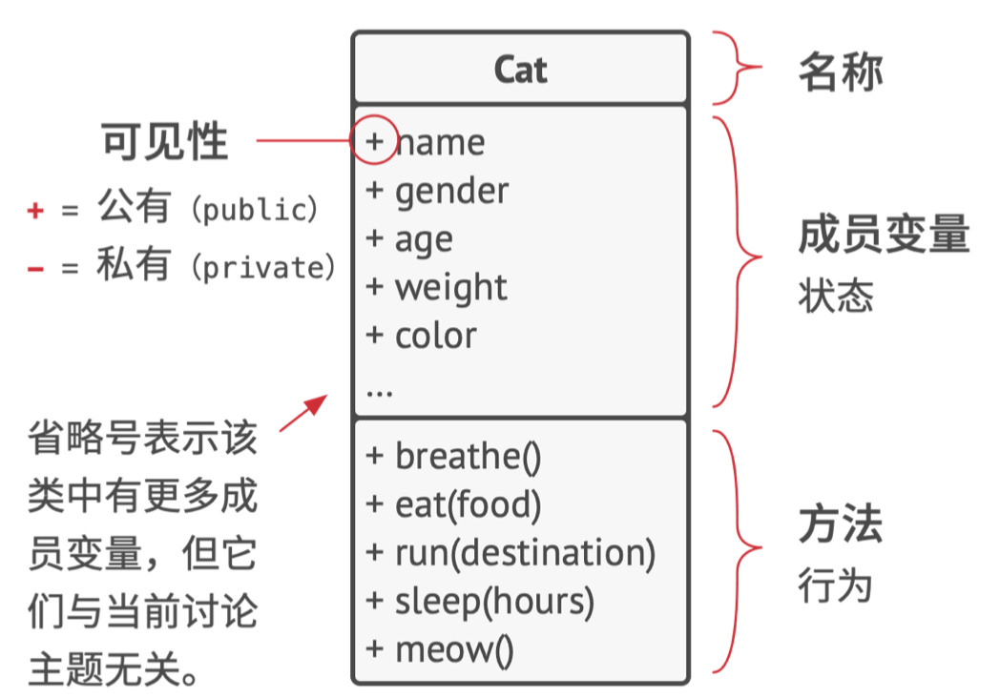

假如有一只名为**卡卡**的猫，卡卡是一个**对象**，也是**猫（Cat）**类的一个实例。

每只猫都有许多基本属性，这些称为该类的**成员变量**。

- 名字：name
- 性别：gender
- 年龄：age
- 体重：weight
- 毛色：color

每只猫有相似的行为，这些称为该类的**成员方法**。

- 呼吸：breathe
- 进食：eat
- 奔跑：run
- 睡觉：sleep
- 喵喵叫：meow

**成员变量**和**成员方法**统称为类的成员，存储在对象成员变量中的数据通常被称为**状态**，对象中的所有方法则定义了其**行为**。

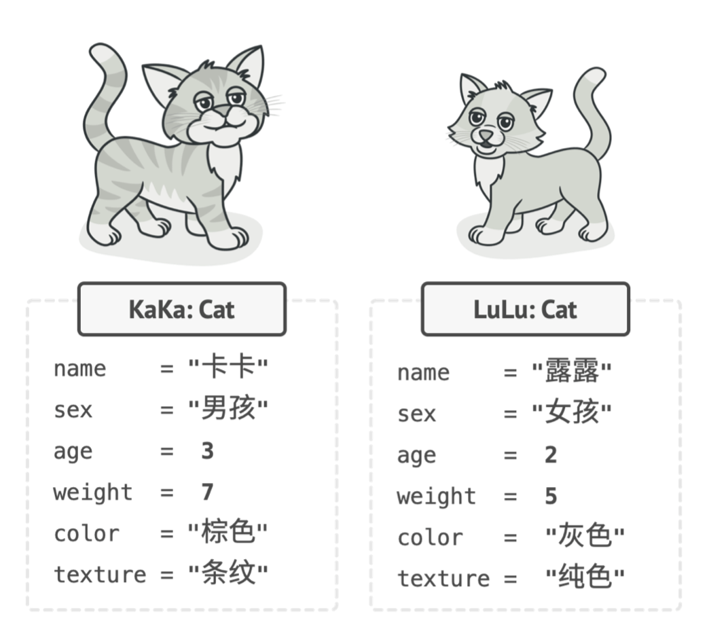

**类就像是定义对象结构的蓝图，而对象则是类的具体实例。**

### 1.1.2 类层次结构

一个实际的程序显然会包含不止一个类，一些类可能会组织起来形成**类层次结构**。

假如有一只狗叫**福福**，猫与狗有很多相同的地方：名字、性别、年龄、毛色等属性，呼吸、睡觉、奔跑等行为。

因此可以定一个**动物（Animal）**基类来列出它们所**共有的属性和行为**。

- 父类/基类/超类
- 子类/派生类

子类会继承其父类的**状态和行为**，其中只需定义不同于父类的属性或行为。

> 因此**猫类**包含**喵喵叫（meow）**方法，**狗类**包含**汪汪叫（bark）**方法。

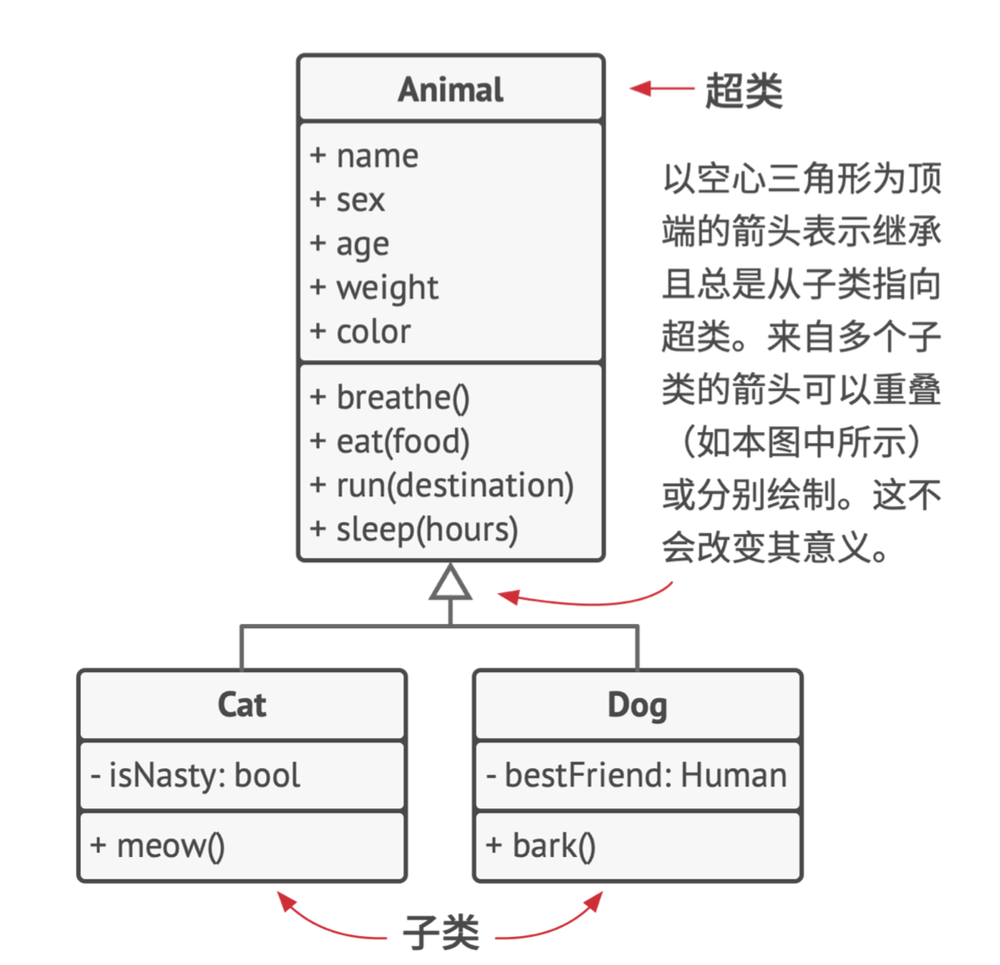

可以继续为所有活的**生物体（Organisms）**抽出一个更通用的类，并将其作为**动物（Animal）**和**植物（Plant）**的基类。

这种由各种类组成的金字塔就是**层次结构**，在这个层次结构中，**猫类**将继承动物类和生物体类的全部内容。

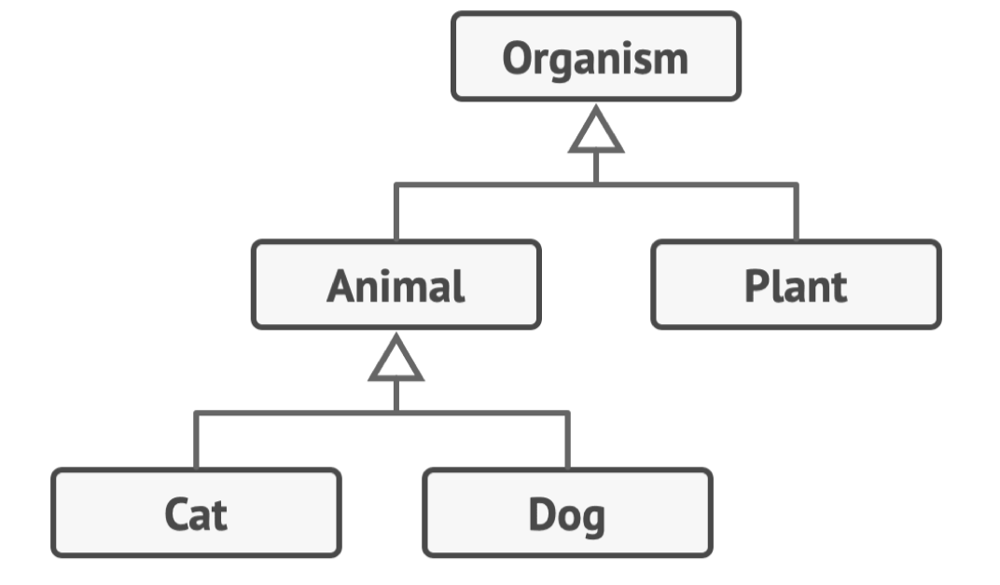

子类可以对从父类中继承而来的方法的行为进行**重写**，子类既可以完全替换默认行为，也可以仅提供额外内容来对其进行加强。

### 1.1.3 四个基本概念

**面向对象程序设计**的四个基本概念使其区别于其他程序设计范式。

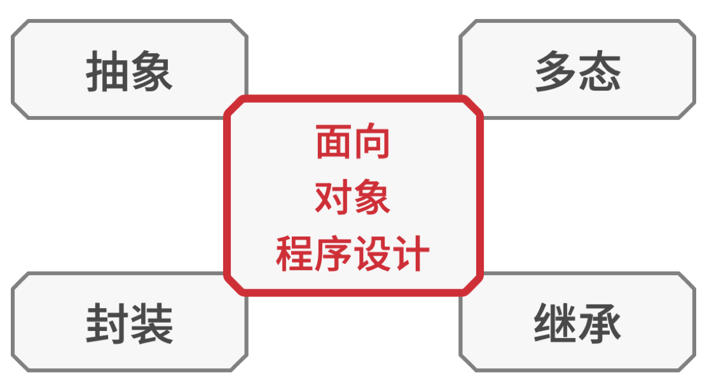

#### 抽象

使用面向对象程序设计的理念开发一款程序时，多数时间用于**根据真实世界对象来设计程序中的对象**。

**程序中的对象不需要百分百准确地反映其原型**（极少情况下才需要做到这一点）。

实际上，你的对象只需要**模拟真实对象的特定属性和行为**即可，其他内容可以忽略。

> 例如，飞行模拟器和航班预订程序中都可能包含一个**飞机（Airplane）**类，但是前者需包含与实际飞行相关的详细信息，而后者则只关心座位图和哪些座位可供预订。
>
> 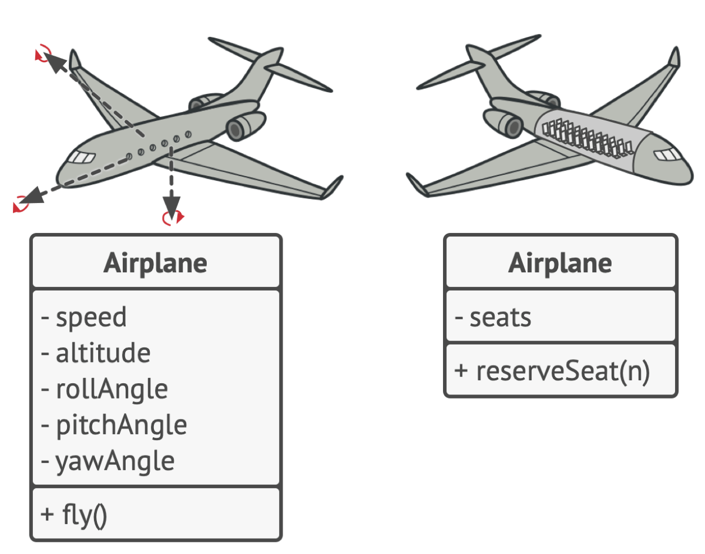

**抽象**是一种反映真实世界对象或现象中特定内容的模型，它能高精度地反映所有与特定内容相关的详细信息，同时忽略其他内容。

#### 封装

如果要启动一辆车的发动机，**你只需要转动钥匙或按下按钮即可**，无需打开引擎盖手动接线、转动曲轴和气缸并启动发动机的动力循环。

上述细节都隐藏在引擎盖下，你只看到一些简单的接口：启动开关、方向盘和一些踏板。

- **接口：**它是对象的公有部分，能够同其他对象进行交互。

**封装**是指一个对象对其他对象**隐藏其部分状态和行为**，而仅向程序其他部分暴露有限的接口的能力。

**封装**某个内容通过关键字**private（私有）**来对其进行修饰，这样仅有其所在类中的方法才能访问到这些内容。

还有一种限制程度较小的关键字**protected（保护）**，其所修饰的对象仅允许父类访问其类中的成员。

| 继承方式            | private继承     | protected继承     | public继承                   |
| :------------------ | :-------------- | :---------------- | :--------------------------- |
| 基类的private成员   | 不可见          | 不可见            | 不可见                       |
| 基类的protected成员 | 变为private成员 | 仍为protected成员 | 仍为protected成员            |
| 基类的public成员    | 变为private成员 | 变为protected成员 | 仍为public成员仍为public成员 |

绝大部分编程语言的**接口和抽象类（或方法）**都基于抽象和封装的概念。

现代面向对象的编程语言中，接口机制（通常用**interface**或**protocol**声明）允许你定义对象之间的交互协议。

接口**仅关心对象行为**，你无法在接口中声明成员变量。

> 例如，**航空运输（Flying Transport）**接口中有一个`fly(origin, destination, passengers)`方法（即以起点、终点以及乘客为参数的飞行方法）。
>
> 在设计航空运输模拟器时，可以对**机场（Airport）**类做出限制，使其仅与实现了**航空运输**接口的对象进行交互。
>
> 这样可以确保传递给机场对象的任何对象——无论是**飞机、直升机、还是其他的东西**都能到达或离开这种类型的机场。

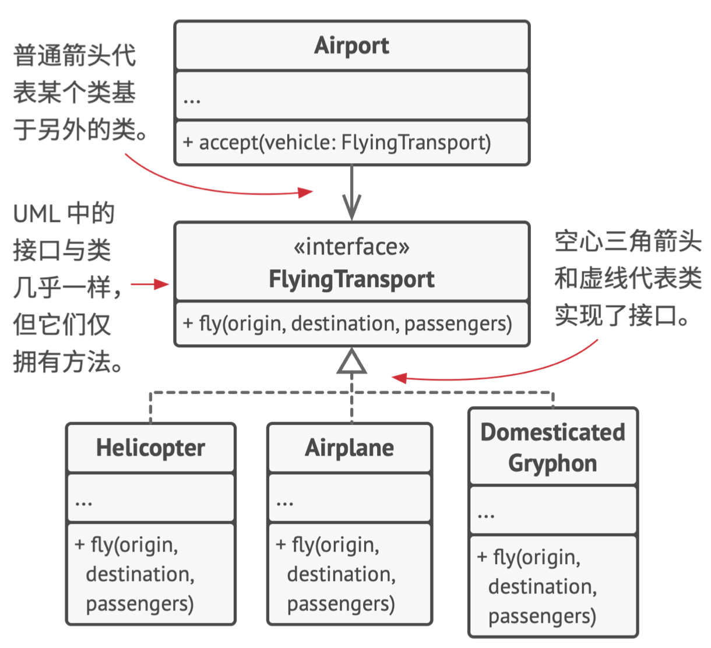

你可以任何方式更改这些类中`fly`方法的实现方式，只要方法签名与接口中的声明保持一致，那么所有**机场类**的实例都能与飞行对象进行交互。

#### 继承

**继承**是指在根据已有类创建新类的能力。

**继承**最主要的好处是**代码复用**，如果想要创建的类与已有的类差异不大，那么没必要重复编写相同的代码。只需扩展已有的类，并将额外功能放入生成的子类（它会继承父类的成员变量和方法）中即可。

使用继承后，**子类拥有与父类相同的接口**，如果父类中声明了某个方法，那么你将无法在子类中隐藏该方法。

同时，子类中必须要实现所有的抽象方法，即使它们对于你的子类而言没有意义。

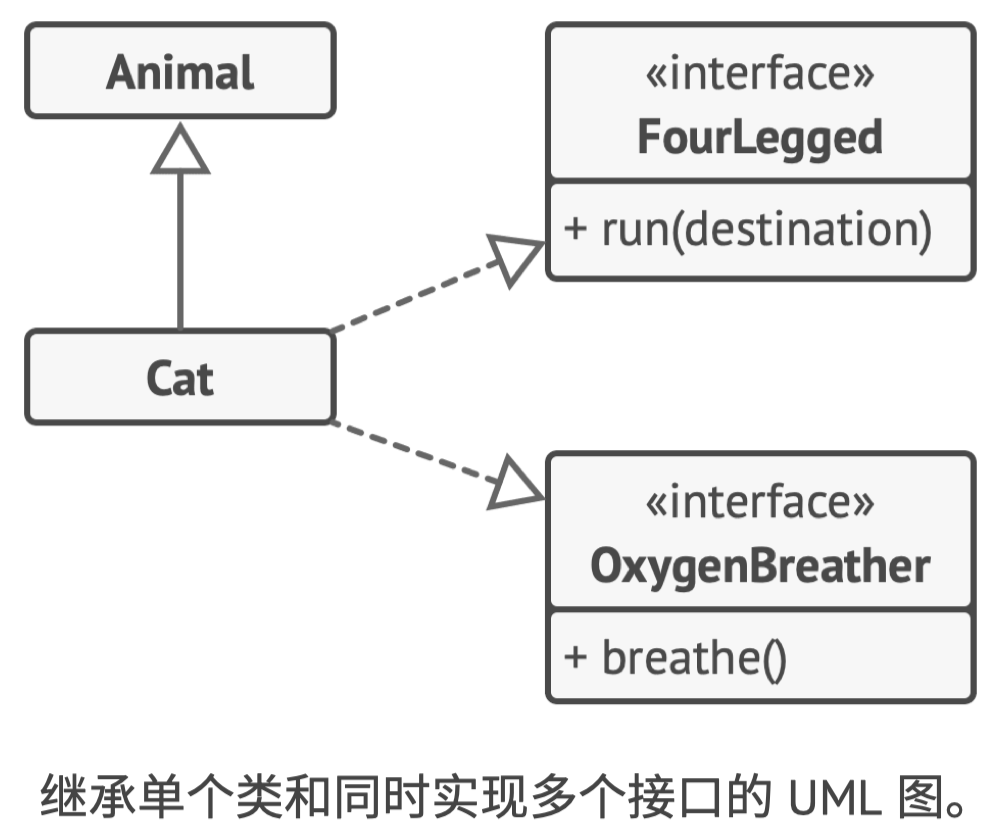

绝大多数编程语言中，**子类仅能对一个父类进行扩展**，但是任何类可以**同时实现多个接口**。

如果父类实现了某个接口，那么其所有子类都必须实现该接口。

#### 多态

绝大部分**动物（Animal）**可以发出声音，需要所有子类**重写**父类的**makeSound（发出声音）**方法，从而让每个子类都发出正确的声音，因此可以将其声明为**抽象函数**。

**抽象函数**可以忽略父类中该方法的所有默认实现，从而强制要求所有子类自行提供该方法的实现。

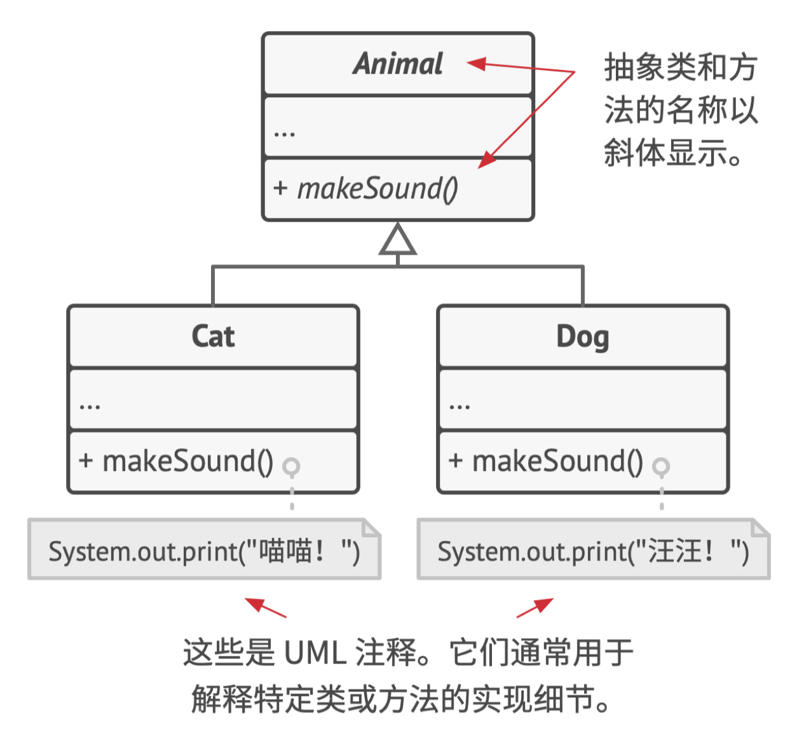

假设将几只猫和狗放入一个袋子中，然后闭上双眼，将动物一个个从袋子中取出，我们并不知道自己取出的是何种动物，但如果我们好好地摸摸它们的话，它就会根据自己具体的类发出特殊的欢快叫声。

```c++
bag = [new Cat(), new Dog()];

foreach (Animal a : bag)
	a.makeSound()

// 喵喵!
// 汪汪!
```

程序并不知道`a`中所包含的对象的具体类型，但幸亏**多态机制**，程序可以追踪对象的子类并调用其方法，从而执行恰当的行为。

**多态**指程序能够检测对象所属的实际类，并在当前上下文不知道其真实类型的情况下调用其实现的能力。

可以将多态看作是一个对象“**假扮**”为其他东西（通常是其扩展的类或实现的接口）的能力，上述例子中，袋中的猫和狗相当于是假扮成了一般的动物。

## 1.2 对象之间的关系

除了**继承**与**实现**之外，对象之间还有其他关系。

### 1.2.1 依赖

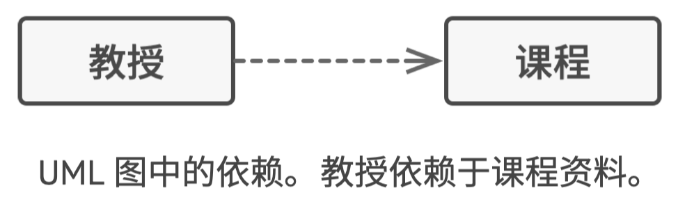

**依赖**是类之间最基础、也是最微弱的关系类型。

如果修改一个类的定义可能会造成另一个类的变化，那么这两个类之间就存在依赖关系。

当在代码中使用具体类的名称时，通常意味着存在**依赖关系**。

通过让代码**依赖接口或抽象类**（而不是具体类），可以降低其依赖程度。

通常情况下，UML图不会展示所有依赖——它们在真实代码中的数量太多了。

- 为了不让依赖关系破坏UML图，需要对其进行精心选择，仅展示那些对于沟通你的想法来说重要的依赖关系。

### 1.2.2 关联

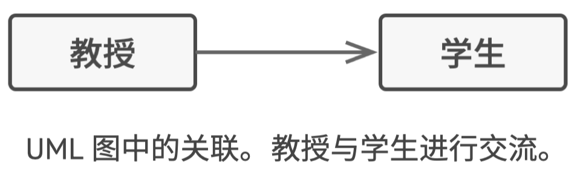

**关联**是一个对象使用另一对象或与另一对象进行交互的关系。

UML图中，关联关系用**起始于一个对象并指向其所使用的对象的简单箭头**来表示。

**双向关联**也是完全正常的，这种情况下用双向箭头来表示。

**关联可视为一种特殊类型的依赖**，即一个对象总是拥有访问与其交互的对象的权限，而简单的依赖关系并不会在对象间建立永久的联系。

通常，可以使用关联关系来表示类似于**类成员变量**的东西。这个关系一直存在，因此你总能通过**订单**来获取其**顾客**。但是它并非一定是成员变量，如果你根据接口来创建类，它也可以表示为一个可返回**订单**的**顾客**的方法。

#### 依赖VS关联

假设有一个名为**教授（Professor）**的类：

```c++
class Professor is
    field Student student
    // ...
    method teach(Course c) is
        // ...
        this.student.remember(c.getKnowledge())
```

对于`teach`（教授知识）方法，它接受一个来自`Course`（课程）类的参数。

如果有人修改了`课程`类的`getKnowledge`（获取知识）方法（修改方法名或添加一些必须的参数等），代码将会崩溃。——这就是**依赖关系**

对于`student`（学生）的成员变量，以及如何在`teach`方法中使用该变量。`Student`（学生）类是`Professor`（教授）类的依赖：如果`remember`（记住）方法被修改，`Professor`（教授）类的代码将崩溃。但由于`Professor`（教授）类的所有方法总能访问`student`（学生）成员变量，所以`student`（学生）类就不仅是以来，而是关联了。

### 1.2.3 聚合

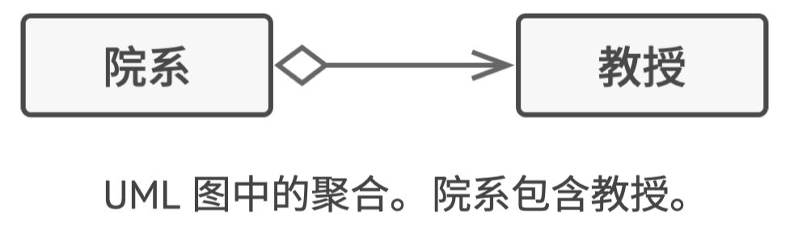

**聚合**是一种特殊类型的**关联**，用于表示多个对象之间的“**一对多**”、“**多对多**”或“**整体对部分**”的关系。

**聚合关系**中，一个对象“**拥有**”一组其他对象，并扮演者容器或集合的角色。

组件可以独立于容器存在，也可以同时连接多个容器。

UML图中，**聚合关系**使用一端是空心菱形，另一端指向组件的箭头来表示。

UML图表示的是**类**之间关系，这意味着**大学**对象可能是由多个**院系**构成，即便图中每个实体只用一个“**方框**”来表示。可以使用UML符号在关系两端标明数量，如果可以从上下文明确数量，则可以省略这类标注。

### 1.2.4 组合

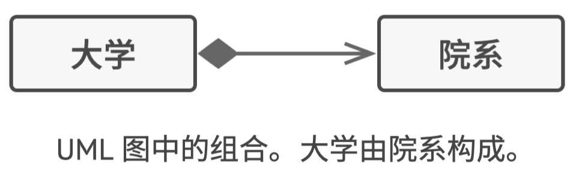

**组合**是一种特殊类型的**聚合**，其中一个对象由一个或多个其他对象实例构成。

组合与其他关系的区别在于，**组件仅能作为容器的一部分存在**。

UML图中，组合与聚合关系的符号相同，但**箭头起始处的菱形是实心的**。

### 1.2.4 总结

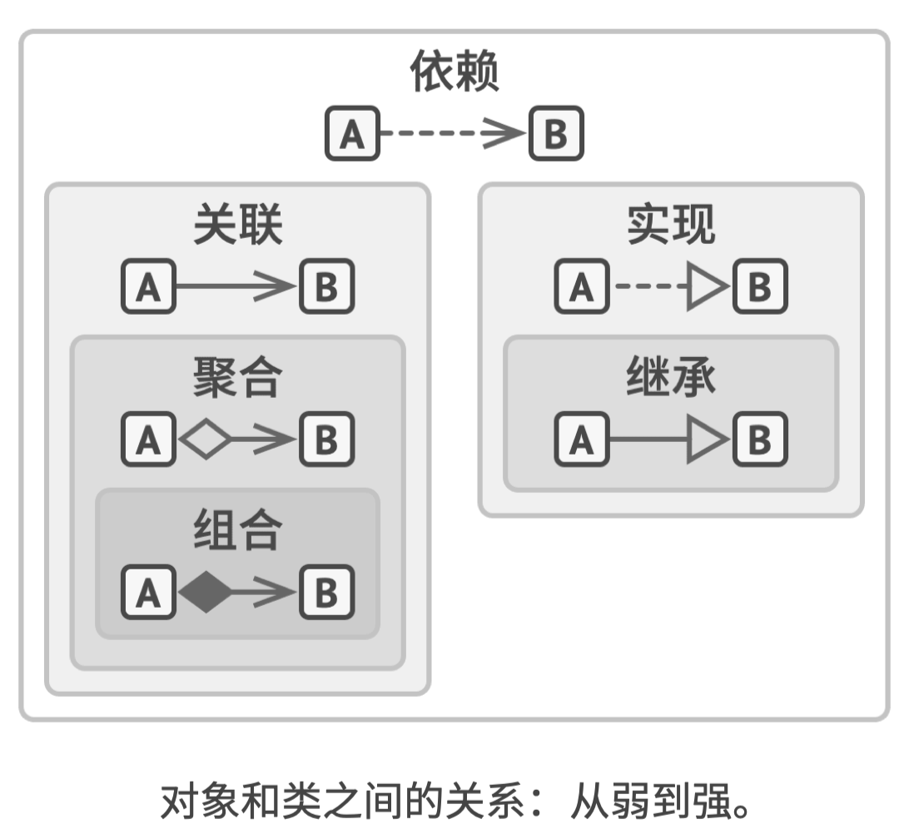

- **依赖：**对类B进行修改会影响到类A。
- **关联：**对象A知道对象B，类A依赖于类B。
- **聚合：**对象A知道对象B且由B构成，类A依赖于类B。
- **组合：**对象A知道对象B、由B构成且管理着B的生命周期，类A依赖于类B。
- **实现：**类A定义的方法由接口B声明，对象A可被视为对象B。类A依赖于类B。
- **继承：**类A继承类B的接口和实现，但是可以对其进行扩展。对象A可以被视为对象B。类A依赖于类B。


